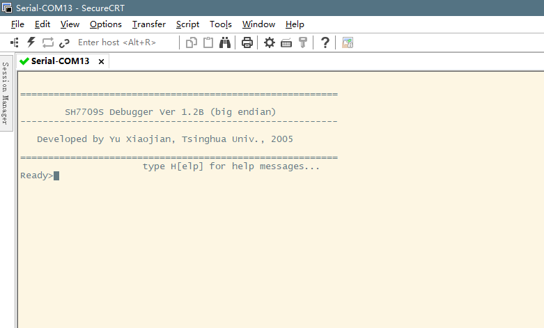

# SH3-HD6417709S-DevBoard-firmware-and-CD
SH3-HD6417709S Development Board Firmware and CD

This development board was designed by Yu Xiaojian. It utilizes the **same memory mapping** as the **CAVE CV1K board** and is equipped with **Double size ** the SDRAM of the CV1K-D board(**Quad size of CV1K-B**).

However, production of this board was extremely limited – only around 200 units were ever made. Therefore, I have dumped the binary from its flash memory, which may be useful for developing a debug tool for the CAVE CV1K system.

